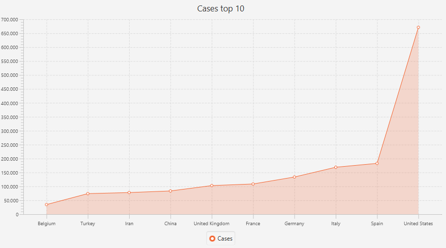
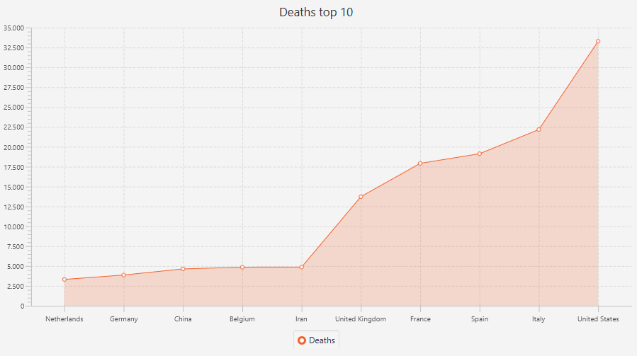
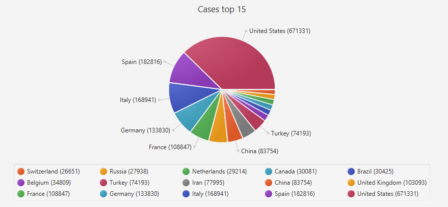
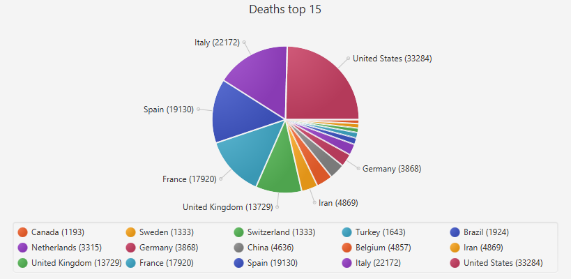
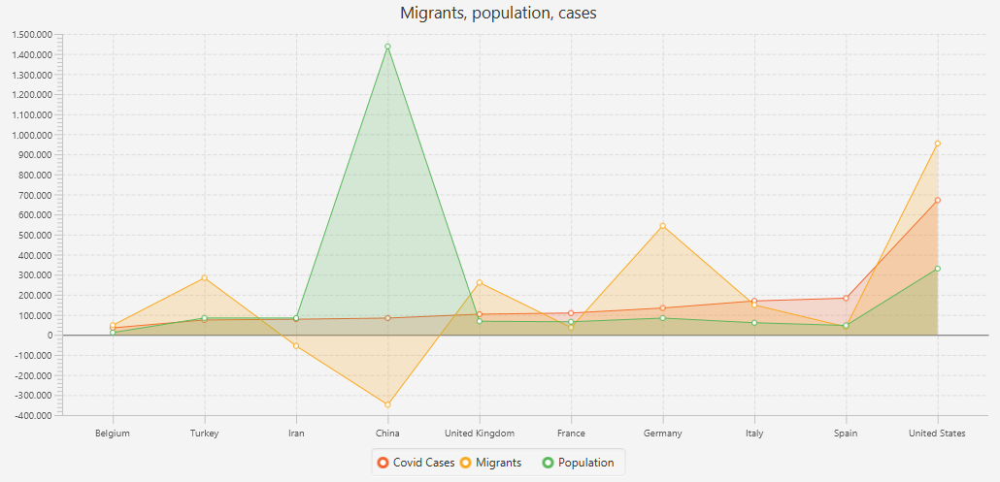
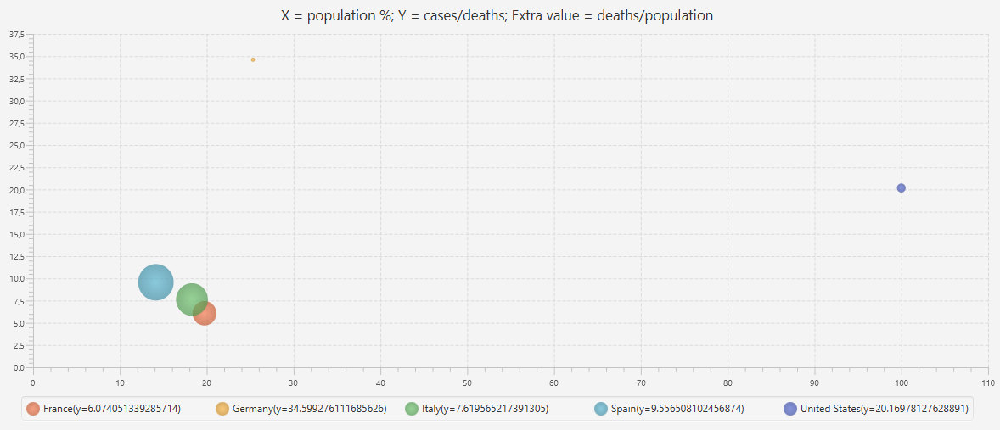
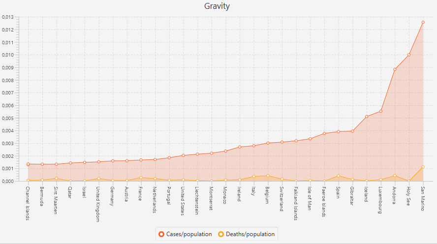

# COVID19-charts

- TornadoFx 1.7.17
- Kotlin 1.2.60
- COVID Data - https://www.ecdc.europa.eu/en/geographical-distribution-2019-ncov-cases
- Population by country - https://www.kaggle.com/tanuprabhu/population-by-country-2020

Run App: 
>$ mvn exec:java -Dexec.mainClass="MainKt"

**Charts:**

